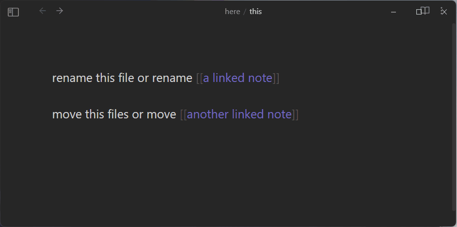

# Obsidian Context-Aware Move and Rename Plugin

Provides context-aware commands for renaming and moving files or links within the Obsidian markdown editor.

  

### Why?

To minimize the use of your keyboard shortcuts end cut down on context switching when manipulating linked notes.

In Obsidian, [renaming a link to a note is only possible by using a mouse](https://forum.obsidian.md/t/keyboard-shortcut-to-rename-links-in-a-note/25213) or through the context menu which is not very convenient. And it's not possible to move the linked note without opening it or using a mouse.

### Features

-   **Context-Aware Renaming:** Rename files or links based on where your cursor is placed within the markdown editor.
-   **Efficient Link-Only Operations:** Perform link-only renaming or moving operations without the risk of accidentaly affecting the currently opened note.
-   **Vim-mode Compatible:** Works in vim-mode.

## Installation

### Community Plugins

1. Open Obsidian.
2. Go to "Settings" > "Community plugins."
3. Search for "Context-Aware Move and Rename"
4. Click "Install" to enable the plugin.

### Manual Installation

1. Download the latest release from the [Releases](https://github.com/aleksey-rowan/obsidian-context-aware-move-and-rename/releases) page.
2. Extract the zip file into your Obsidian plugins folder.
3. Reload Obsidian to activate the plugin.

## Usage

### Commands

| Command Name        | Command ID            | Description                                                                                                                           |
| ------------------- | --------------------- | ------------------------------------------------------------------------------------------------------------------------------------- |
| Rename File or Link | `rename-file-or-link` | Renames a linked note **under the cursor** OR renames the **currently opened note** otherwise (exactly as the default `F2` shortcut). |
| Rename Link Only    | `rename-link-only`    | Renames a linked note **under the cursor**. Does nothing otherwise.                                                                   |
| Move File or Link   | `move-file-or-link`   | Moves a linked note **under the cursor** OR moves the **currently opened note** to a different folder otherwise.                      |
| Move Link Only      | `move-link-only`      | Moves a linked note **under the cursor** to a different folder. Does nothing otherwise.                                               |

### Shortcuts

No defaults shortcuts are provided. You can map them however you want, but I recommend using the `F2` shortcut with the `rename-file-or-link`. This way you keep the default behaviour most of the times and gain the ability to quickly rename links under the cursor.

## License

This plugin is licensed under the [MIT License](LICENSE).

## Acknowledgments

-   Special thanks to **@vanadium23** and his [Obsidian Advanced New File Plugin](https://github.com/vanadium23/obsidian-advanced-new-file/) where I borrowed some of the code for creating a folder selection modal.
